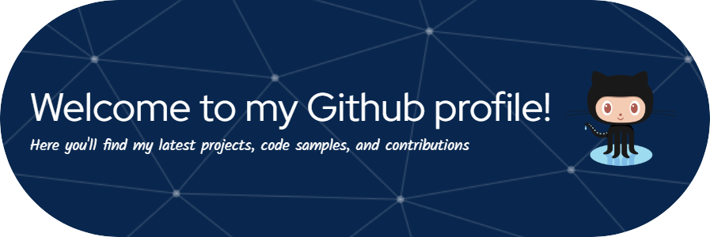

# 💫 About Me:
🔭 I'm currently working to improve my skills in Web Development and Data Structures and Algorithms. 👯 I’m looking to collaborate on Web Dev Projects. 🤝 I’m looking for help with Data Structures and Algorithms. 🌱 I’m currently learning Front-End Development and DSA. 💬 Ask me about DBMS, SQL, JAVA, and Web Development ⚡ Fun fact I'm a huge ESports fan and love to follow ESports tournaments in India for different ESports such as BGMI and Valorant.

## 🌐 Socials:
   

# 💻 Tech Stack:
           	  
 

 

 
 

---
## Profile Vists

  

<!-- Proudly created with GPRM ( https://gprm.itsvg.in ) -->
