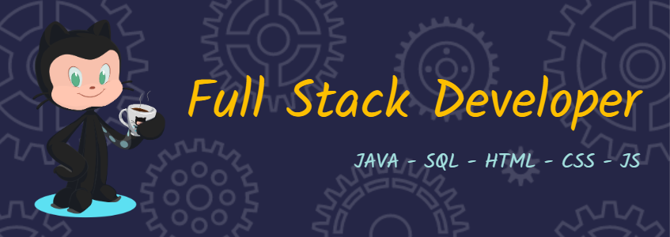

  

<h1 align="center">Hi 👋, I'm Madhur Agarwal</h1>
<h3 align="center">Full Stack Developer - Pre-Final Year Student - India</h3>

  

  

  

- 🔭 I’m currently working on **Hostel Complaint Management System**

- 🌱 I’m currently learning **MERN Stack - DSA using Java**

- 👯 I’m looking to collaborate on **Full Stack Development Projects**

- 💬 Ask me about **Database Management System - Front-End Development - Java Concepts**

- 📫 We can connect via **madhur1812agarwal@gmail.com**

- 📄 Know about my experiences [Madhur Agarwal](tinyurl.com/resumemadhur)

- ⚡ Fun fact **Esports is more than just a hobby for me. It is a way of life. I enjoy watching and playing various Esports titles such as Valorant, Pokemon Unite, and BGMI, which are among the most popular games in India**

<h3 align="left">Connect with me:</h3>

<h3 align="left">Languages and Tools:</h3>

                

&nbsp;

